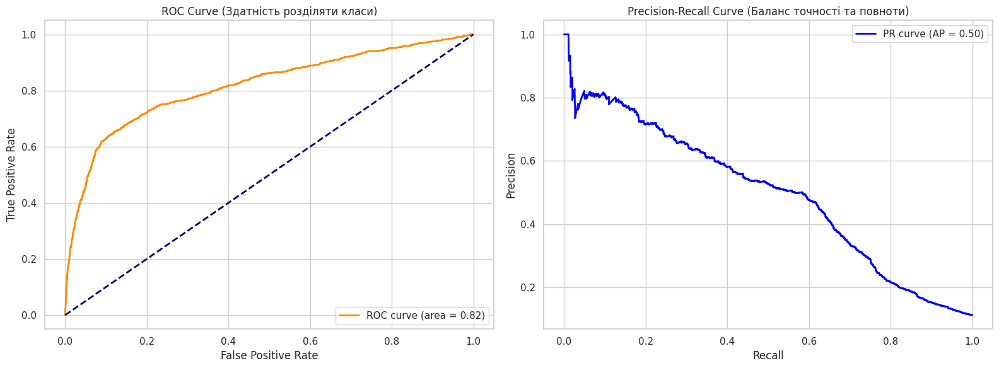

# 🏦 Bank Marketing Campaign Subscription Prediction


---

Даний проєкт присвячений розробці та оптимізації моделі машинного навчання для прогнозування того, чи відкриє клієнт банку строковий депозит після проведення прямої маркетингової кампанії (телефонного дзвінка).

## 🎯 Мета проєкту
На основі історичних даних (41,188 записів) побудувати модель, яка дозволить:
* **Збільшити конверсію** маркетингових кампаній.
* **Зменшити операційні витрати**, відсікаючи клієнтів з низькою ймовірністю згоди.
* **Аналізувати ключові фактори**, що впливають на рішення клієнта.

## 📊 Ключові результати

### Порівняння результатів моделей (Model Comparison)

На етапі розробки було протестовано кілька алгоритмів класифікації. Для кожної моделі використовувався підхід із балансуванням ваг класів (`class_weight='balanced'` або `scale_pos_weight`), оскільки цільова змінна має сильний дисбаланс (лише 11.3% позитивних відповідей).

| Модель | ROC-AUC (Test) | F1-Score (Test) | Статус |
| :--- | :---: | :---: | :--- |
| **XGBoost (Optimized)** | **0.8165** | **0.5051** | 🏆 **Фінальна модель** |
| Logistic Regression | 0.8008 | 0.4661 | Базова модель |
| Decision Tree | 0.7926 | 0.4720 | Базова модель |
| XGBoost (Base) | 0.7864 | 0.4602 | Перенавчена (Overfitted) |
| kNN (k-Nearest Neighbors)| 0.7357 | 0.3604 | Низька ефективність |

#### 📝 Аналіз вибору:
* **XGBoost (Optimized)** став лідером після проведення байєсівської оптимізації через `Hyperopt`. Модель показала найкращий результат за метрикою **F1-Score**, що є критично важливим для мінімізації помилок у маркетингових кампаніях.
* **Logistic Regression** продемонструвала високу стабільність, що підтверджує хорошу лінійну роздільність макроекономічних факторів.
* **XGBoost (Base)** мав ознаки сильного перенавчання (AUC на тренувальних даних складав > 0.92), що було успішно виправлено за допомогою регуляризації в оптимізованій версії.

Після порівняння кількох алгоритмів та проведення байєсівської оптимізації гіперпараметрів, була обрана модель **XGBoost**.

| Метрика | Значення | Опис |
| :--- | :--- | :--- |
| **ROC-AUC** | **0.8165** | Висока здатність моделі розділяти класи |
| **F1-Score** | **0.5051** | Збалансований показник точності та повноти |
| **Precision** | **0.4150** | У 4 рази вище за базову ймовірність згоди (11%) |
| **Recall** | **0.6450** | Модель знаходить 64.5% всіх потенційних вкладників |

#### 📈 Візуалізація результатів

*Графік ROC-AUC та Precision-Recall для фінальної моделі*

## 🛠 Технологічний стек
* **Мова:** Python 3.12
* **Обробка даних:** Pandas, NumPy, Scikit-learn
* **Моделювання:** XGBoost, Logistic Regression, Decision Tree
* **Оптимізація:** Hyperopt (Bayesian Optimization), Sklearn RandomizedSearch
* **Інтерпретація:** SHAP (Shapley Additive Explanations)
* **Візуалізація:** Matplotlib, Seaborn

## 📈 Ключові інсайти (SHAP Analysis)
За допомогою аналізу SHAP значень було виявлено найважливіші фактори впливу:
1. **Макроекономіка:** Кількість працевлаштованих (`nr.employed`) та процентна ставка (`euribor3m`) є головними предикторами.
2. **Лояльність:** Попередній успішний досвід взаємодії (`poutcome_success`) гарантує високий шанс на нову згоду.
3. **Ефективність каналів:** Мобільний зв'язок показує значно кращі результати, ніж стаціонарні телефони.
4. **Вік:** Студенти та пенсіонери є найбільш схильними до відкриття депозитів сегментами.

## 📂 Структура репозиторію
* `Bank_Marketing_Midterm.ipynb` — основний Jupyter ноутбук із повним циклом дослідження.
* `models/` — папка із збереженою фінальною моделлю (`.joblib`).
* `requirements.txt` — файл із переліком необхідних бібліотек.
* `preprocess.py` та `models_config.py` — допоміжні скрипти для архітектури Pipeline.

```angular2html
bank-marketing-prediction/
├── data/                       # Дані
│   └── bank-additional-full.csv
├── images/                     # Файли візуалізацій
│   ├── shap_summary.png
│   ├── roc_curve.png
│   └── age_distribution.png
├── models/                     # Збережені навчені моделі
│   └── bank_deposit_model_xgb.joblib
├── notebooks/                  # Jupyter Notebooks
│   └── Bank_Marketing_Midterm.ipynb
├── src/                        # Допоміжний вихідний код (.py файли)
│   ├── preprocess.py           # BankDataTransformer та get_preprocessor
│   └── models_config.py        # Словник моделей
├── .gitignore                  # Файли, які Git має ігнорувати (__pycache__, .env)
├── README.md                   # Головний опис проєкту
└── requirements.txt            # Список бібліотек (залежностей)
```

## 🚀 Як запустити
1. **Клонуйте репозиторій:**
   ```bash
   git clone [https://github.com/e1ephntbrd/bmd-ml-midterm.git](https://github.com/e1ephntbrd/bmd-ml-midterm.git)